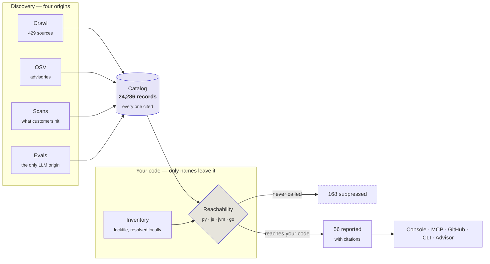

<div align="center">

# BugMine


**Every dependency breaks. Know which ones break you.**

A holistic catalog of known defects across an entire software stack — breaking changes,
deprecations, regressions, performance and security — and a scanner that reports only the ones
your code actually reaches.

[**Live**](https://bugmine-5j2s4vtc.uc.gateway.dev/) ·
[Motivation](docs/motivation/) ·
[Requirements](docs/requirements/) ·
[Architecture](docs/architecture/) ·
[Decisions](docs/adr/)

</div>

---

## Why

Dependency scanners are the wrong shape for how software actually breaks.

| Measured | |
| ---: | --- |
| **92%** | false-positive rate across 2,414 repositories — defects flagged in code that never reaches them |
| **61.9%** | of those false alarms removed by reachability analysis alone |
| **70%** | of vulnerable dependencies need an upgrade that may break source compatibility |
| **67%** | of Maven packages have violated semantic versioning |
| **52% → 10%** | GPT-4's code-execution success rate over three months, **with no version change** |

The last row is the one nothing else catalogs. Hosted models change behaviour under a stable
identifier with no artifact recording it — so there is nothing for a lockfile to pin or a diff to
show. Sources in [`docs/motivation/`](docs/motivation/).

## What it does differently

**Reports what reaches you.** Scanning [`python-poetry/poetry`](https://github.com/python-poetry/poetry):

```
80 dependencies · 224 catalog matches
├── 168 suppressed  — the code never calls them
├──  56 reported    — each citing the record that grounds it
└──  76 uncovered   — stated out loud, because silence reads as health
```

**75% suppressed.** That is our own measurement, not the borrowed 61.9%.

**Catalogs what CVEs miss.** Of 24,286 records, **20,131 have no CVE** — deprecations and
breaking changes are the bulk of what actually breaks builds.

| | records |
| --- | ---: |
| deprecation | 9,835 |
| breaking change | 8,316 |
| security | 4,155 |
| functional | 1,883 |
| performance | 97 |

**Says when it does not know.** An uncovered component, an unresolvable manifest and an
undetermined reachability verdict are three different answers, and none of them is "clean".

## How it works



The third stage is the one other tools skip, and the reason a BugMine report is shorter than a
dependency scanner's.

## Surfaces

| | Question it answers | State |
| --- | --- | --- |
| **Search** | What is known about this software? | live, public, no account |
| **Scan** | What is wrong with the code I have? | live — measured at 75% suppression |
| **Advise** | Given what I plan to build, what will I run into? | live |
| **Evals** | What is wrong that nobody has reported? | built; no scheduler yet |

## Quickstart

Search the catalog with no account at all:

```bash
curl 'https://bugmine-5j2s4vtc.uc.gateway.dev/v1/public/bugs/search?q=sqlalchemy&limit=5'
curl 'https://bugmine-5j2s4vtc.uc.gateway.dev/v1/public/stats'
```

In Cursor or Claude Code, so an agent can ask on your behalf while you work:

```json
{"mcpServers": {"bugmine": {
  "command": "uvx",
  "args": ["--from", "git+https://github.com/knotking/bug-mine#subdirectory=packages/bugmine",
           "bugmine-mcp"],
  "env": {"BUGMINE_URL": "https://bugmine-5j2s4vtc.uc.gateway.dev",
          "BUGMINE_API_KEY": "bmk_…"}}}}
```

From the command line — your lockfile is resolved locally and only names and versions are sent:

```bash
export BUGMINE_URL=https://bugmine-5j2s4vtc.uc.gateway.dev
export BUGMINE_API_KEY=bmk_…
bugmine check
```

## Working on it

```bash
uv sync
docker run -d --name bugmine-test-pg -e POSTGRES_PASSWORD=dev \
  -e POSTGRES_DB=bugmine_test -p 55432:5432 postgres:16
uv run pytest          # 382 tests, ~5s
uv run ruff check .
```

Deployment — including teardown, since the environment is meant to be destroyable and
rebuildable — is in [`.claude/skills/deploy/`](.claude/skills/deploy/SKILL.md).

## Layout

| Path | |
| --- | --- |
| `packages/bugmine/` | the system — 9,100 lines |
| `packages/bugmine/src/bugmine/reach/` | reachability, one module per language |
| `packages/bugmine/src/bugmine/evals/` | probes and rate-based corroboration |
| `packages/bugmine/src/bugmine/worker/` | crawl, extract, scan, OSV |
| `tests/` | 5,200 lines, 382 tests |
| `infra/terraform/` | GCP: Cloud Run, Cloud SQL, Cloud Tasks, API Gateway |
| `docs/` | requirements, architecture, ADRs, motivation |

## Decisions worth reading

The reasoning that shaped the system, rather than the code that resulted:

- [**Grounding and provenance**](docs/adr/0002-grounding-and-provenance.md) — why every finding
  cites a record, enforced structurally rather than by prompt
- [**Reachability**](docs/adr/0006-reachability-analysis.md) — narrow statically, judge with a
  model; the largest cost fork in the system
- [**Untrusted content in model pipelines**](docs/adr/0005-untrusted-content-in-model-pipelines.md)
  — why the worker with network access has no model, and the one with a model has no network
- [**Scan-derived entries**](docs/adr/0004-scan-derived-catalog-entries.md) — corroboration
  before one customer's observation becomes everyone's

## What is not built

Stated because a README that only lists what works is a sales page:

- **GitHub App** is written and tested but unregistered — no App ID, so no PR has ever been checked
- **Evals have no scheduler.** Periodic re-runs are the entire mechanism for detecting model
  drift; without one the capability has no trigger
- **Own-code analysis** works but `scan_analyze` does not call it yet
- **Reachability covers four languages.** Swift, Rust, Ruby and .NET are catalogued and
  searchable, and their findings come back undetermined rather than narrowed
- **Promotion has never run in production** — no tenant has enough scans to corroborate anything

## Licence

Not yet chosen.
