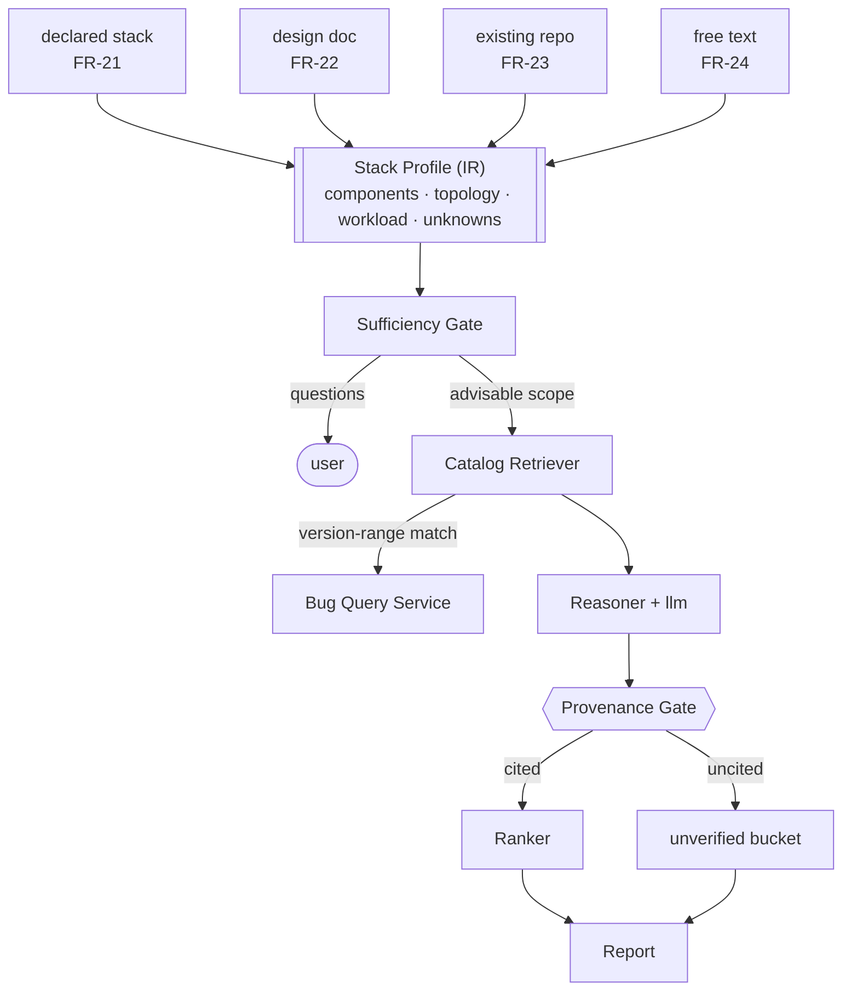

# BugMine Advisor — Architecture

**Status:** Draft, for discussion
**Requirements:** FR-21 – FR-35 in [`../requirements/advisor.md`](../requirements/advisor.md).
**Builds on:** [`ingestion.md`](ingestion.md) — the advisor is a consumer of that catalog and a
job on the same substrate, not a new pipeline.
**Constraint update, 2026-08-22:** NFRs now exist — NFR-3 (advice p95 < 90 s for ≤ 30
components), NFR-21 (per-tenant inference routing is a hard guarantee), and NFR-39/40 (per-job
cost ceiling) all bind this design. A-D4 below is affected by the last of these.

---

## 1. The organizing principle: an hourglass

Four intake types (FR-21 – FR-24) must produce one kind of output. Building four pipelines
guarantees four behaviors that drift apart — the free-text path grows a heuristic the repo path
lacks, and no one notices until the answers disagree.

Instead: an hourglass with the **Stack Profile** at the waist. Everything above it is
input-specific and knows nothing about advising. Everything below it advises and knows nothing
about where the input came from.

The payoff is concrete: **adding an intake type is one adapter and zero downstream change.**
That is the entire justification for the IR, and it is why FR-25 is a requirement rather than an
implementation detail.

---

## 2. Components

| Component | Owns | Must never | Exposes |
| --- | --- | --- | --- |
| **Intake adapters** (4) | Turning one input form into a Stack Profile | Query the catalog or reason about problems | Nothing — invoked by the advisor worker |
| **Stack Profile** | The normalized facts, *including what is unknown* | Carry input-format residue | — |
| **Sufficiency Gate** | Deciding what can be advised on and what cannot | Guess a missing value to keep going | Targeted questions (FR-27) |
| **Catalog Retriever** | Matching profile components to catalog records by version range | Reach Bug DB directly | Retrieved record set |
| **Reasoner** | Predicting problems from *retrieved records only* | Invent components or bug records | Candidate findings |
| **Provenance Gate** | Enforcing FR-32 structurally | Be a prompt instruction | Grounded set + unverified set |
| **Ranker** | Ordering by likelihood × impact for this stack | Reorder by generic severity | Ranked findings |

---

## 3. The two decisions that make this trustworthy

### Provenance is enforced at a boundary, not requested in a prompt

You cannot prompt a model into being grounded. FR-32 is met structurally instead:

1. The Reasoner receives **only** the records the Retriever returned — never the raw catalog,
   never an open-ended search.
2. Its output schema **requires** a catalog record ID per finding.
3. The **Provenance Gate** drops or diverts any finding whose cited ID was not in the retrieved
   set. A hallucinated citation fails a set-membership check; it does not need to be detected.

This is the difference between a product and a demo. Everything else here is arrangement; this
is the part that makes the output mean something.

### The sufficiency gate scopes, it does not reject

FR-26 through FR-28 together mean the gate is not a validator. It partitions the profile into
what can be advised on now and what cannot, emits questions for the second (FR-27), and lets the
first proceed (FR-28). Placing it *before* retrieval also avoids spending catalog queries and
tokens on a profile that cannot support conclusions.

The failure this prevents is specific and severe: an advisor that answers thinly-specified input
with confident generic advice is indistinguishable, to its user, from one that found real
grounded problems.

---

## 4. Boundaries

| Boundary | Crosses | Sync? | When the far side is gone |
| --- | --- | --- | --- |
| Job Queue → advisor worker | `advise` job with input reference | async | Lease expires, redelivered — worker must be idempotent per job |
| Intake adapter ↔ `llm` | Doc/free-text → structured profile (FR-22, FR-24) | sync | Job retries; declared-stack and repo intake are unaffected, having no model dependency |
| Retriever → **Bug Query Service** | Component + version-range query | sync | Fail the job — advising with an unreachable catalog would produce only ungrounded output, which FR-32 forbids shipping as advice |
| Reasoner ↔ `llm` | Retrieved records → candidate findings | sync | Job retries; retrieval already durable |
| Advisor worker → Job Service | State transitions | async | Job state stale; advice still completes |

The third row is the one to notice: **catalog unavailable means fail, not degrade.** Degrading to
model-only advice would silently convert BugMine into a chatbot with a confident tone.

---

## 5. Failure modes

- **Confidently wrong extraction.** A design doc says "Postgres" and the adapter records
  `postgresql@unknown`; retrieval then matches every version's bugs. Unknown versions must widen
  results *and* be surfaced as an FR-27 question, not silently treated as "all versions".
- **Empty catalog reads as a clean bill of health.** At launch the catalog is thin, so "no
  findings" will usually mean "not covered". FR-39 now requires this to be stated explicitly
  rather than returned as silence — the single most likely way early users would be misled.
- **Ranking without workload.** FR-31 needs the stated scale; absent it, a scale-triggered bug
  ranks the same as an always-on one. Missing workload should lower confidence, not be ignored.
- **Version-range false positives.** Covered in [`../data-model/stack-profile.md`](../data-model/stack-profile.md) — the quiet failure, since a wrong match looks exactly like a right one.
- **Model or prompt drift between intake types.** The IR bounds this: only adapters use a model
  for parsing, and they emit a schema that can be diffed across types.

---

## 6. Open decisions

| # | Decision | Blocked on |
| --- | --- | --- |
| **A-D1** | Interactive advisor (question round trips) vs one-shot report | Open question A1 |
| ~~A-D2~~ | Whether uncovered components are stated explicitly or silently omitted | **Closed 2026-08-22** by FR-39: coverage is explicit and an uncovered subject returns "not covered", never silence. |
| **A-D3** | Retrieval strategy: exact component match, or semantic search over records | Catalog size; exact match is right while seeded |
| **A-D4** | Whether the Reasoner is one call or one per component with a synthesis pass | Cost ceiling; the second grounds better and costs more |

---

## 7. What this does not cover

Own-code analysis (FR-36, FR-37) is **not** part of the advisor. It reasons about code it has
never seen rather than retrieving known records, so the Provenance Gate in §3 does not apply to
it — which is exactly why FR-37 requires its findings to be presented separately. It needs its
own design pass.
