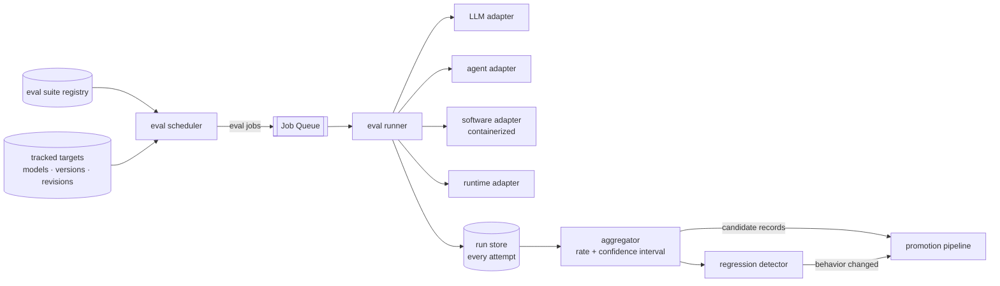

# BugMine Evals — Architecture

**Status:** Draft, for discussion
**Requirements:** FR-47 – FR-56, FR-5, NFR-39, NFR-40.
**Builds on:** [`ingestion.md`](ingestion.md) (job substrate), [`promotion.md`](promotion.md).

---

## 1. Eval results are measurements, not observations

This is the distinction the whole design turns on, and it separates evals from both other origins.

A crawled record is a **claim** someone published. A scan finding is an **inference** about code.
An eval result is a **measurement** — and measurements have distributions.

`../requirements/discovery.md` D2 names the consequence as the hardest open problem in that
document: **LLM defects are frequently probabilistic.** A model emitting malformed structured
output 4% of the time is a real, expensive defect that a boolean "reproduces *n* times running"
rule (FR-55) would reject outright.

So the store holds **runs**, not verdicts. A run records what was attempted, what came back, and
whether it satisfied the assertion. A catalog candidate is created from an *aggregate over runs*
carrying a failure rate and a confidence interval — never from a single run. This makes a 4%
defect expressible, which a boolean cannot, and it makes "we could not reproduce it" a
statistically meaningful statement rather than an anecdote.

## 2. Structure

## 3. Components

| Component | Owns | Must never | Notes |
| --- | --- | --- | --- |
| **eval suite registry** | What evals exist, what they assert, what they target | Execute anything | Versioned — FR-52 requires the eval's own version on every record |
| **tracked targets** | Which models, versions and revisions are under observation | — | Drives FR-53's automatic re-runs |
| **eval scheduler** | Deciding what is due | Interpret results | A control-plane producer, like the crawl scheduler |
| **eval runner** | Executing one eval against one target | Decide whether a defect exists | Emits runs, not verdicts |
| **target adapters** | Speaking to one target class | Leak across classes | The only target-specific code |
| **run store** | Every individual attempt, with inputs and outputs | Discard failed runs | Discarding them destroys the denominator |
| **aggregator** | Turning runs into a rate with a confidence interval | Assert from one run | Where FR-55 is actually implemented |
| **regression detector** | Comparing aggregates across revisions | — | The mechanism behind FR-53 |

## 4. The regression detector is the point

For LLM models there is no changelog, no version bump, and no crawlable artifact when behavior
shifts — a floating alias silently repoints and every downstream user inherits new behavior. Per
`../requirements/discovery.md` §1, evals are the **only** viable origin for that entire subject
domain.

The regression detector is what converts that into a product capability: a suite that passed at
rate *r* last week and passes at rate *r′* today, with non-overlapping confidence intervals, is a
detected behavioral change. **That comparison is the only signal such a change ever generates**,
and it produces a catalog record nobody else in the market can produce, because it requires having
been measuring beforehand.

This also imposes a design constraint: the run store must retain history at run granularity for
long enough to establish a baseline. Aggregating and discarding runs would make the second
measurement uncomparable to the first.

## 5. Failure modes

- **Eval flakiness indistinguishable from target regression.** The eval's own infrastructure —
  network, rate limits, harness bugs — produces failures that look like target defects. Runs must
  record failure *class*, and infrastructure failures must be excluded from the denominator rather
  than counted as target failures.
- **The eval itself is wrong.** A bad assertion manufactures catalog records at scale. Eval suite
  versions are part of record provenance (FR-52) precisely so a bad suite's output can be found
  and retracted (FR-67) as a set.
- **Cost runaway.** FR-53 re-runs indefinitely across tracked targets × suites × frequency. This is
  cost of goods, not R&D, and NFR-40's ceiling must apply per eval job.
- **Non-determinism at low rates.** Detecting a 1% failure needs many runs; the cost of confidence
  rises sharply as the effect shrinks. There is a floor below which defects are real but
  economically undetectable, and it should be stated rather than discovered.
- **Vendor rate limits and terms.** Repeatedly probing a commercial API at volume may breach terms
  independently of what is found.

## 6. Open decisions

| # | Decision |
| --- | --- |
| **E-D1** | The statistical rule for candidate creation — minimum runs, confidence level, and effect size floor. This is D2 in `../requirements/discovery.md` and remains the hardest open problem. |
| **E-D2** | Whether software and runtime evals run against containerized real targets or recorded fixtures. Real targets are honest and much more expensive. |
| **E-D3** | Whether tenants can author eval suites (D3 in discovery), and whether a tenant-authored suite may produce shared-catalog records. |
| **E-D4** | Disclosure policy for defects evals find in commercial products (D5 in discovery) — needed *before* the first real finding, not after. |
| **E-D5** | Whether agent evals target frameworks or deployed configurations (D6 in discovery); the second is closer to own-code analysis than to catalog building. |
