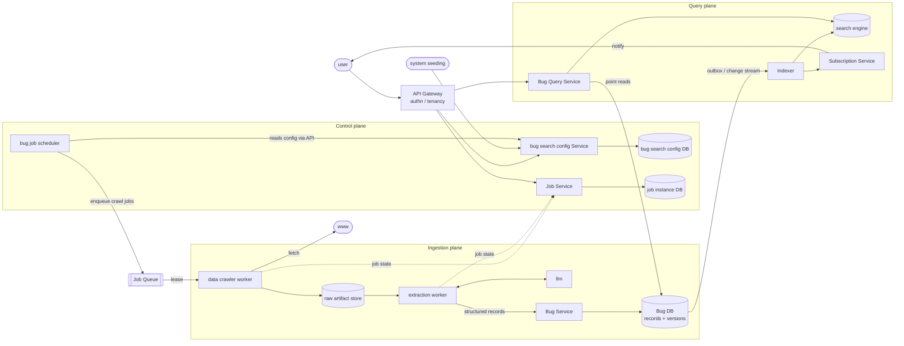

# BugMine — Ingestion and Search Architecture

**Status:** Draft, for discussion
**Sources:** `~/searchengine.png` (hand-drawn "Bug Data Ingestion Pipeline" sketch) and
`docs/requirements/bugmine.md` (FR-1 – FR-20).
**Constraint update, 2026-08-22:** NFRs now exist in
[`../requirements/non-functional.md`](../requirements/non-functional.md), though every number in
them is proposed rather than agreed. §8 records which decisions they unblock. The component
structure below was determined by the FRs alone and is unaffected.

---

## 1. The organizing principle

The sketch draws twelve boxes at one level, which is why concerns ended up in the wrong homes.
The fix is to separate the system into **three planes plus one shared substrate**, and to make
every box belong to exactly one:

| Plane | Answers | Changes | Traffic |
| --- | --- | --- | --- |
| **Control plane** | What should be crawled, on what schedule, and what happened when it ran | Rarely, by humans and system seeding | Low |
| **Ingestion plane** | Turning the outside world into versioned bug records | Constantly, in bulk bursts | High, batchy |
| **Query plane** | Answering user questions about the catalog | Constantly, interactively | High, latency-sensitive |
| **Job substrate** *(shared)* | Running work asynchronously and reporting what it did | — | — |

Two consequences follow, and they are the substance of this document.

**Ingestion and query must not share a service.** In the sketch, `Bug Service` takes crawler
writes *and* serves user `/bug/search`. Those have opposite profiles: crawling arrives in bulk
bursts and can wait; a user search is interactive and cannot. Sharing a service means a large
crawl degrades search for every user, and it removes the ability to scale the two independently.

**Crawl jobs and scan jobs are the same abstraction.** The sketch builds a queue, workers, and a
job instance DB for crawling. Scanning (FR-12 – FR-16) needs precisely the same three things,
and FR-20 already requires uniform telemetry across "crawler runs and scan runs alike" — which
is only cheap if they share a substrate. Build the job substrate once, generic over job type,
rather than building a parallel scan pipeline later.

---

## 2. Structure

Where the other surfaces attach: a Scan API, an Advise API, and an Eval scheduler each enqueue
onto the **same** Job Queue with their own job type; their workers lease from it, read the catalog
through **Bug Query Service** (never directly from Bug DB), and report state to the **same** Job
Service. No second pipeline, for any of them.

**Update, 2026-08-22 — crawling is no longer the only origin.** Per
[`../requirements/discovery.md`](../requirements/discovery.md), records now enter from three
origins: crawling, scans (FR-41), and evals (FR-47 – FR-50). Structurally this changes less than
it sounds, because all three converge on **Bug Service** as the sole writer of Bug DB — the
boundary that made the plane split work in the first place. Two things it does change:

- **Bug Service must accept a record origin (FR-40) and a promotion status (FR-43).** Candidate
  records are tenant-visible only, so the read path through Bug Query Service now filters on
  visibility as well as on FR-11's private-system rule.
- **A promotion pipeline is new machinery** — it consumes candidates, evaluates corroboration
  (FR-44), sanitizes (FR-45), and promotes. It is a stream consumer like the Indexer, not a job,
  and its health is therefore measured as lag (NFR-33).

---

## 3. Components

| Component | Owns | Must never | Exposes |
| --- | --- | --- | --- |
| **API Gateway** | Authentication, tenant resolution, rate limiting | Contain business logic | All user-facing routes |
| **bug search config Service** | `bug search config DB` — the sole writer | Execute crawls or read job state | Crawl source CRUD, `/bug/config/schedule` (FR-3, FR-4) |
| **bug job scheduler** | Deciding *when* a configured source is due | Write config; write bug data | Nothing user-facing |
| **Job Service** | `job instance DB` — job lifecycle for every job type | Know what a crawl or scan *means* | Job state API (FR-6) |
| **data crawler worker** | Fetching remote content, honoring robots/rate limits | Parse or interpret content | Nothing — it leases work |
| **extraction worker** | Turning raw artifacts into structured bug records via LLM | Fetch from the network | Nothing — it leases work |
| **Bug Service** | `Bug DB` — sole writer of bug records and versions | Serve user queries | Internal ingest API |
| **Bug Query Service** | Read access to the catalog | Write anything | Search (FR-7), poll (FR-8), reports (FR-10) |
| **Indexer** | Keeping `search engine` consistent with `Bug DB` | Be the source of truth | Nothing |
| **Subscription Service** | Subscriptions and delivery (FR-9) | Poll the DB in a loop | Subscription CRUD |

The one-sentence test: every row above states its job without the word "and". `Bug Service` in
the sketch could not.

---

## 4. Boundaries

| Boundary | Crosses | Sync? | When the far side is gone |
| --- | --- | --- | --- |
| scheduler → **Job Queue** | Job descriptor (type, target, config version) | async | Jobs accumulate; scheduler must be idempotent per due-window so a retry does not double-enqueue |
| **Job Queue** → workers | Leased job with visibility timeout | async | Lease expires, job redelivered — **workers must be idempotent** (see §5) |
| crawler worker → `www` | HTTP fetch | sync | Job fails and retries with backoff; a permanently dead source must surface as staleness, not silence |
| extraction worker ↔ `llm` | Prompt / structured response | sync | Job retries; raw artifact is already durable, so no re-crawl needed |
| extraction worker → **Bug Service** | Structured bug records | sync | Job retries; dedup by content hash prevents duplicate versions |
| `Bug DB` → **Indexer** | Change events via outbox or change stream | async | Index goes stale; search still serves, flagged degraded (§7) |
| **Bug Query Service** → `search engine` | Query | sync | Fall back to Bug DB point reads or fail the search — decision D3 |

---

## 5. The crawl write path, end to end

1. **Scheduler** finds a source due per `bug search config DB`, read *through* the config
   service, and enqueues a crawl job carrying the config version it was scheduled under.
2. **Crawler worker** leases the job, fetches, and writes the response body verbatim to the
   **raw artifact store**, keyed by content hash.
3. **If the content hash is unchanged since the last crawl, the pipeline stops here.** This is
   the single most important step in the diagram: without it, FR-5's versioning creates a new
   version on every crawl of every source forever, and catalog size becomes a function of crawl
   frequency rather than of how often upstream software actually changes.
4. **Extraction worker** leases the artifact, calls the **llm** to produce structured records,
   and posts them to Bug Service.
5. **Bug Service** writes a new version only where a record's *content* changed, and emits a
   change event.
6. **Indexer** consumes the event and updates the **search engine**; **Subscription Service**
   consumes the same event to satisfy FR-9.

Separating step 2 from step 4 is deliberate: **raw artifacts are stored before extraction**, so
when the extraction prompt or model improves, the whole corpus can be re-extracted without
re-crawling the internet. Fusing crawl and extraction — as the sketch does, with `llm` hanging
directly off the crawler worker — makes every model improvement a full re-crawl.

---

## 6. What changed from the sketch, and why

| # | In the sketch | Change | Why |
| --- | --- | --- | --- |
| 1 | Arrows mix call direction and data flow (`www —/bug/data→ worker`, `worker —/pull/job→ Q`) | All arrows are data flow; leases marked explicitly | The core crawl loop was ambiguous in the drawing |
| 2 | `Bug Service` takes crawler writes and serves user search | Split into **Bug Service** (write) and **Bug Query Service** (read) | Bulk ingestion must not degrade interactive search; they scale differently |
| 3 | `bug search config Service` reads `job instance DB` | New **Job Service** owns job state | Job lifecycle is unrelated to search config; FR-6 belongs on its own contract |
| 4 | `bug job scheduler` and config service both read/write `bug search config DB` | Scheduler reads **through** the config service | Two writers on one store couples the services and destroys the invariant owner |
| 5 | `llm` hangs off the crawler worker, unlabeled | Named **extraction worker**, with a **raw artifact store** in front | Enables re-extraction without re-crawling; separates I/O-bound from token-bound work |
| 6 | `Bug DB —/copy→ search engine` | Named **Indexer** fed by an outbox/change stream | `/copy` had no mechanism, no trigger, and no staleness story |
| 7 | Bug DB is one box | Explicitly records **plus versions**, with content-hash dedup | FR-5 is unimplementable as drawn, and undeduplicated versioning grows without bound |
| 8 | `user` connects straight to services | **API Gateway** with authn and tenant resolution | FR-11's private-system rule needs a boundary to be enforced at |
| 9 | No component for FR-9, FR-10 | **Subscription Service**; reports on Bug Query Service | Requirements had no home |
| 10 | Queue is crawl-specific (`Crawler Job Q`) | Generic **Job Queue** over job type | FR-20 requires uniform crawl/scan telemetry; scanning reuses the substrate |
| 11 | — | Telemetry from all workers (FR-20) | Every worker is a job; instrument the substrate once |

Also: `scehduler` → `scheduler`.

---

## 7. Failure modes

- **A crawler silently stops.** The catalog keeps serving and looks healthy; results are just
  stale. Nothing in the sketch detects this. Staleness per source must be a first-class metric
  under FR-20, alerting on "no successful run in N" — not on error rate, which stays at zero.
- **Indexer falls behind.** Search returns stale results with no signal. Index lag must be
  measured and surfaced, since FR-7 promises version and timestamp on results.
- **Extraction produces wrong records.** LLM extraction fails softly — plausible, wrong data.
  Every record must carry provenance back to its raw artifact so a bad batch can be identified
  and re-extracted.
- **Extraction is fed hostile content.** Crawled pages are authored by whoever controls them, and
  a successful injection writes attacker-chosen records into a *shared* catalog. Controls are in
  [ADR-0005](../adr/0005-untrusted-content-in-model-pipelines.md) and NFR-41 – NFR-46; the
  architectural consequence here is that the extraction worker must have **no tool access and no
  network egress beyond its model endpoint**, which constrains this component permanently.
- **Queue backs up under a large scheduled sweep.** Interactive search is unaffected once the
  planes are split (change 2) — that is the main thing the split buys.
- **Duplicate job delivery.** At-least-once leasing means workers run twice; content-hash
  dedup (§5) makes this harmless rather than version-inflating.

---

## 8. Open decisions

Each is an `adr` candidate. None can be closed without NFRs.

| # | Decision | Status after NFRs |
| --- | --- | --- |
| **D1** | Index every bug version, or current-only with point-in-time lookups from Bug DB | **Partly unblocked.** NFR-7 sizes the corpus at 500k versions — tractable either way. Still needs a product answer on whether FR-7 means point-in-time search. |
| **D2** | Indexer trigger: transactional outbox, DB change stream, or scheduled batch | **Unblocked.** NFR-5 caps index lag at p95 < 5 min, which rules out scheduled batch at any useful interval. Outbox or change stream. |
| **D3** | Search-engine outage behavior: fail, or degrade to Bug DB point reads | **Unblocked.** NFR-11 (99.9% query plane) and NFR-13 (available while ingestion is degraded) require degrading, not failing. |
| **D4** | Whether "private system" (FR-11) is a tenant, a deployment, or a record flag | **Still open.** Q4, now with a dual-deployment complication — see NFR-25 and open question N3. |
| **D5** | Queue and search engine technology | **Unblocked to choose.** NFR-6 – NFR-10 give the sizing; NFR-9's 10× CI burst is the binding constraint on the queue. |
| **D6** | Whether extraction is a separate worker pool or a stage in one worker | **Unblocked.** NFR-39/40 require per-job cost attribution and a hard ceiling, which is far cleaner with extraction as its own job type. |

---

## 9. Requirements coverage

Covered: FR-1 – FR-11 (catalog, crawlers, versioning, job state, search, poll, subscribe,
reports, sharing boundary), FR-20 (worker telemetry via the shared substrate).

**Not covered here** — the scan path (FR-12 – FR-16), own-code analysis (FR-36, FR-37), billing
(FR-17), and product metrics (FR-18, FR-19).

**Correction, 2026-08-22:** this section previously stated the scanner was the only uncovered
surface. That was written before the advisor existed. The catalog is a hub with **three**
consumers — search/subscribe (covered here), scan, and advise. The advisor's architecture is in
[`advisor.md`](advisor.md) and attaches to the job substrate exactly as §1 predicted, which is
the first evidence that the shared-substrate bet holds.
