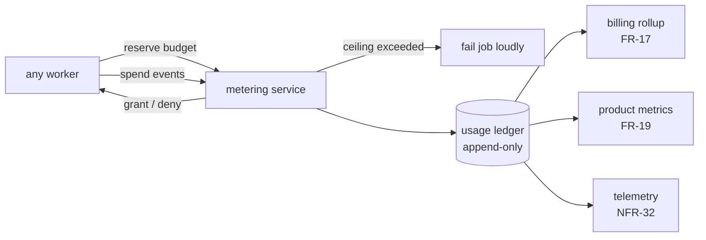

# BugMine Metering and Billing — Architecture

**Status:** Draft, for discussion
**Requirements:** FR-17 – FR-19, NFR-32, NFR-39, NFR-40.

---

## 1. Metering is an inline control, not downstream analytics

The natural design is to emit usage events, aggregate them later, and bill monthly. NFR-40 makes
that wrong:

> A single job cannot exceed its ceiling without failing loudly — cost overrun is a job failure,
> not a silent charge.

Enforcing that requires the ceiling to be checked **inside the job loop, while the job runs**. By
the time an aggregation pipeline sees the events, the tokens are spent and the money is gone. So
the meter is on the critical path of every job that spends anything, which is a materially
different component from a billing rollup.

The reason is not tidiness. BugMine bills on token usage (FR-17) and its workers are LLM-driven
loops over content it does not control — a pathological repository or an injected page that
induces a long generation is one bad input away from an unrecoverable bill. **Anything that bills
on a quantity it cannot cap is unbounded by construction.**

## 2. Structure

Every job **reserves** a budget before starting and reports spend as it goes. Exhausting the
reservation fails the job with a distinct, user-visible reason — not a generic error, since the
user needs to know they hit a limit rather than a bug.

## 3. What must be attributable

| Dimension | Why |
| --- | --- |
| Tenant / team / user | FR-17 bills per team and per user |
| Job type | Crawl, extract, scan, advise, eval, report — cost profiles differ by an order of magnitude |
| Inference tier | NFR-21 lets tenants pin to self-hosted models; the cheaper tier is also the weaker one |
| Record origin | Lets catalog cost per useful record be computed — the number that says whether an origin pays for itself |

The last two are not obvious and both matter. **Per-tier attribution is the only way to see the
consequence flagged in the NFRs**: a tenant on self-hosted inference gets cheaper, weaker findings,
and FR-19's metrics are not comparable across tiers without this dimension.

## 4. Eval cost is cost of goods, not R&D

FR-53 re-runs evals indefinitely across tracked targets × suites × frequency, with no user request
triggering any of it. Unlike a scan, nobody is billed for it directly, and it grows with catalog
ambition rather than with revenue.

That makes eval spend structurally different from every other cost in the system and it needs its
own budget and its own visibility. Left inside a general inference line item, the one cost that
scales with ambition rather than with customers becomes invisible.

## 5. Failure modes

- **Metering service unavailable.** Fail closed or open? Failing open risks unbounded spend;
  failing closed halts all work. Recorded as B-D1 — this is the decision that matters most here.
- **Reservation too coarse.** A single reservation for a long job either over-reserves (blocking
  capacity) or under-reserves (frequent renewals on the hot path).
- **Self-hosted deployments emit nothing.** A self-hosted tenant's usage is invisible, so NFR-32's
  attribution and FR-19's metrics have a structural gap. Related to N4.
- **Ledger and provider disagree.** Token counts from the meter will drift from the provider's
  invoice; reconciliation must exist before it is discovered at scale.

## 6. Open decisions

| # | Decision |
| --- | --- |
| **B-D1** | Metering unavailable: fail closed or fail open |
| **B-D2** | Reservation granularity — per job, per stage, or per model call |
| **B-D3** | Whether advice runs count as scans for FR-19's metrics (A4 in `../requirements/advisor.md`) |
| **B-D4** | Whether self-hosted deployments report usage at all, and what that means for billing them |
| **B-D5** | Whether ceilings are per job, per tenant per period, or both |

The implementation plan for all of this is in [`../plan/token-accounting.md`](../plan/token-accounting.md), which settles the ledger shape and the enforcement points and carries the remaining decisions as T-D1 – T-D6.
