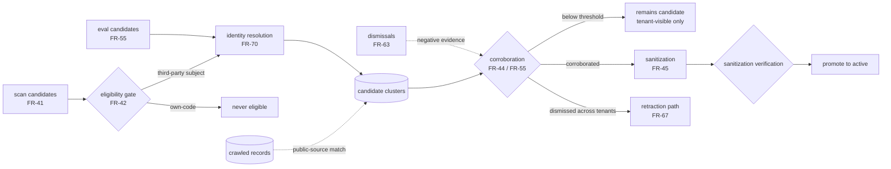

# BugMine Promotion Pipeline — Architecture

**Status:** Draft, for discussion
**Requirements:** FR-40 – FR-46, FR-63, FR-64 – FR-71, NFR-19, NFR-45, NFR-46.
**Implements:** [ADR-0004](../adr/0004-scan-derived-catalog-entries.md).

---

## 1. This component is a privacy control

Everywhere else in BugMine, a bug in a component produces a wrong answer. Here it produces a
**data leak**: promoting a candidate that should have stayed private exposes one tenant's
information to every other tenant, irreversibly, since you cannot un-show it.

ADR-0004's entire privacy argument — that a record observed across *k* unaffiliated tenants is a
statement about software rather than about anyone — is a claim about this pipeline's behavior. The
argument is only as good as the implementation, which means this component needs the treatment
given to security controls: explicit tests for the negative case, auditability of every decision,
and a bias toward not promoting.

## 2. Structure

It is a **stream consumer, not a job** — like the Indexer, its health is measured as lag rather
than job outcome (NFR-33).

## 3. Stages

| Stage | Does | The failure that matters |
| --- | --- | --- |
| **Eligibility gate** | Rejects anything whose subject is the tenant's own code (FR-42) | A leak. This is the absolute rule, and it belongs first so nothing downstream can undo it. |
| **Identity resolution** | Clusters candidates describing the same defect (FR-70) | Under-clustering silently starves corroboration; over-clustering merges distinct defects |
| **Corroboration** | Counts unaffiliated tenants (FR-44), reproducing runs (FR-55), or a public-source match | Affiliation errors — two tenants under one parent company are not independent |
| **Sanitization** | Strips tenant code, identity, and stack composition (FR-45) | Residual re-identification through specificity |
| **Verification** | Confirms sanitization actually removed what it claims | Assumed-but-unverified sanitization is how leaks ship |
| **Promotion** | Sets state to `active` (FR-64) | — |

## 4. Identity resolution is the hard part, and FR-44 silently depends on it

FR-44 promotes on corroboration by "*k* unaffiliated tenants **or a matching public source**".
Both clauses are identity problems: recognizing two tenants hit the same defect, and recognizing a
crawled record describes it too.

**Without identity resolution, cross-origin corroboration never fires at all** — every candidate
sits below threshold forever and the flywheel produces nothing. This is the dependency ADR-0004
did not make explicit, and it is why FR-70 exists.

It is genuinely hard: a changelog entry, a model's description of a code symptom, and an eval
assertion describe one defect in three vocabularies. L1 in
[`../requirements/record-lifecycle.md`](../requirements/record-lifecycle.md) records it as
unsolved. A conservative starting heuristic — same component, overlapping applicability, similar
symptom — will under-cluster, which starves the flywheel but does not leak. **That is the correct
direction to fail in**, and it should be a deliberate choice rather than an accident.

## 5. Failure modes

- **Affiliation blindness.** Two tenants that are subsidiaries of one company are not independent
  observers. Corroboration counts them as two and the privacy argument quietly weakens.
- **Sanitization by assumption.** Stripping code but leaving a stack description so specific it
  identifies one customer. Verification must test re-identification, not just absence of literals.
- **Dismissal gaming.** FR-63 lets cross-tenant dismissal drive retraction; a hostile tenant could
  dismiss indiscriminately to degrade the shared catalog. Same defence as promotion — require
  unaffiliated tenants.
- **Promotion of a poisoned record.** ADR-0005's injection path terminates here. A crawled record
  that no other origin corroborates should be weaker evidence, which makes this pipeline the
  natural place to enforce that.
- **Pipeline lag.** Candidates queue while the catalog stays thin; invisible unless lag is measured
  (NFR-33).

## 6. Open decisions

| # | Decision |
| --- | --- |
| **P-D1** | The value of *k*, and whether it varies with record specificity — a highly specific record identifies its source more readily and should need more corroboration (D1 in discovery) |
| **P-D2** | How tenant affiliation is determined, given corporate structures the system cannot see |
| **P-D3** | Whether promotion requires human review while volume is low — ADR-0004 explicitly leaves this open and compatible |
| **P-D4** | Whether a tenant may opt out of contributing candidates, and whether opting out affects what it receives (D4 in discovery) |
| **P-D5** | How sanitization verification is tested — this is the control that most needs an adversarial test and least obviously has one |
