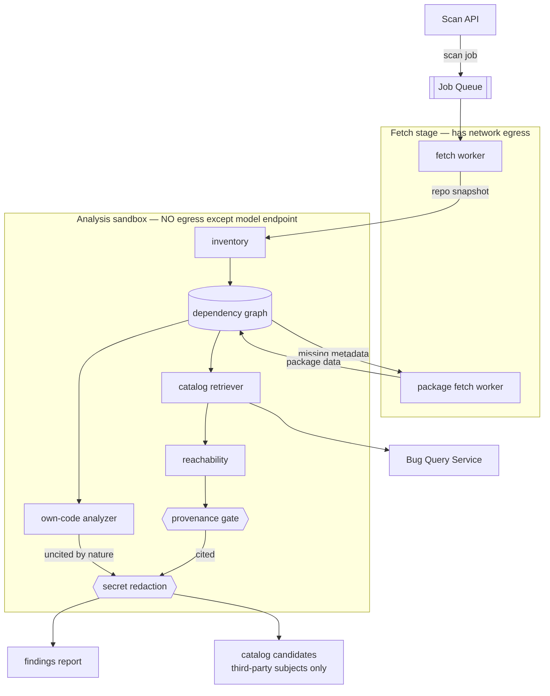

# BugMine Scanner — Architecture

**Status:** Draft, for discussion
**Requirements:** FR-12 – FR-16 (catalog scanning), FR-36 – FR-37 (own-code analysis),
FR-41 – FR-42 (candidate contribution), NFR-4, NFR-10, NFR-20, NFR-21, NFR-24, NFR-42.
**Builds on:** [`ingestion.md`](ingestion.md) (job substrate), [ADR-0002](../adr/0002-grounding-and-provenance.md) (provenance),
[ADR-0004](../adr/0004-scan-derived-catalog-entries.md) (candidates), [ADR-0005](../adr/0005-untrusted-content-in-model-pipelines.md) (untrusted input).
**Depends on:** [ADR-0006](../adr/0006-reachability-analysis.md), still `Proposed`. Reachability is
the largest cost fork in BugMine and this design is shaped around it.

---

## 1. The scanner is two engines in one pipeline

FR-12 – FR-16 and FR-36 – FR-37 look like one feature and are not. They share intake, inventory,
and reporting; they share nothing in how they know things.

| | **Catalog engine** | **Own-code engine** |
| --- | --- | --- |
| Answers | Which known third-party bugs reach this code? | What is defective in the code itself? |
| Method | Retrieve records, then test reachability | Analyze code directly |
| Evidence | A cited catalog record | The system's own judgment |
| ADR-0002 applies | **Yes** — provenance gate | **No** — nothing to cite |
| Can produce catalog candidates | Yes (FR-41) | **Never** (FR-42) |
| Output section | Grounded findings | Separate section (FR-37) |

Merging them would collapse the distinction FR-37 exists to preserve and, worse, would let
un-citable output flow into the candidate path that FR-42 forbids. **The separation is a privacy
control, not a presentation preference.**

## 2. Structure

## 3. The three decisions that shape this

### The dependency graph is a first-class artifact, not a lookup

Nothing in the requirements or the data model modelled dependency relationships, yet three things
need them and cannot work without:

- **Reachability** (FR-12) — whether a defect in a transitive dependency is on any real path
- **Blast radius** (FR-33, and the positioning's "dependency depth") — currently uncomputable
- **JIT package pull** (FR-14) — knowing *what* is missing requires knowing what is required

So `inventory` emits a resolved graph — direct and transitive edges, versions, and the manifest
evidence for each — and everything downstream reads it. It is also reusable: **the advisor's repo
intake (FR-23) is exactly this stage**, so it should be one component serving both surfaces
rather than two implementations that disagree about what a project depends on.

### The sandbox cannot fetch, which settles a previously-open question

ADR-0005 and NFR-42 require the analysis stage to have no network egress beyond its model
endpoint, because it feeds third-party code to a model. But FR-14 requires fetching package data
just in time. These are contradictory in one component.

Resolution: **fetch and analysis are separate jobs in separate trust zones.** The fetch stage has
egress and no model; the analysis sandbox has a model and no egress. The graph is completed
before the sandbox opens, and a mid-analysis discovery of missing data suspends the job back to
the fetch stage rather than reaching out from inside.

This closes the question Appendix B of [`../requirements/bugmine.md`](../requirements/bugmine.md)
left open — whether `package_pull` is its own job type. It must be, and the deciding constraint
turned out to be security rather than caching, though it delivers the caching benefit too:
package data fetched for one tenant is public data, reusable across tenants.

### Secret redaction is a boundary, not a formatting step

NFR-24 forbids secrets in scanned code reaching findings, reports, logs, or telemetry. Customer
repos routinely contain credentials, and every stage downstream of the sandbox emits text
containing code excerpts.

Redaction therefore sits **at the sandbox exit**, as a gate every output crosses — the same
structural position as the provenance gate, and for the same reason: once a secret is in a log
line or a span attribute it has already escaped, and a redaction step in the report renderer is
too late by several components.

## 4. Components

| Component | Owns | Must never | Notes |
| --- | --- | --- | --- |
| **Scan API** | Accepting scans, returning job handles (FR-13) | Run analysis inline | Async per FR-13 |
| **fetch worker** | Retrieving the repo snapshot | Interpret code | Has egress; no model |
| **package fetch worker** | Resolving missing package metadata (FR-14) | Read customer code | Has egress; cross-tenant cacheable |
| **inventory** | The resolved dependency graph | Reach the network | Shared with advisor FR-23 |
| **catalog retriever** | Matching graph components to records | Reach Bug DB directly | Same version-range rules as the advisor |
| **reachability** | Deciding whether a defect reaches this code | Invent call paths | See ADR-0006 |
| **own-code analyzer** | Defects in the customer's own code (FR-36) | Emit catalog candidates | FR-42 is absolute |
| **provenance gate** | ADR-0002 enforcement on catalog findings | Apply to own-code output | Own-code has no citation by nature |
| **secret redaction** | NFR-24 at the sandbox boundary | Be bypassed by any output path | Includes logs and telemetry |

## 5. Failure modes

- **Incomplete dependency resolution.** A lockfile-less project, a private registry, or an
  unsupported ecosystem yields a partial graph. FR-14's grounding clause requires reporting the
  scan as incompletely grounded — a partial graph silently scanned looks identical to a clean one.
- **Reachability false negatives are worse than false positives here.** Suppressing a real bug
  because reachability said "not reached" is the failure users never see. ADR-0006's approach must
  fail toward reporting with lower confidence rather than silently dropping.
- **Own-code findings leaking into candidates.** The FR-42 violation. Because it is a privacy
  breach rather than a bug, the separation needs a test asserting no own-code finding ever reaches
  the candidate path — not merely code review.
- **Secrets in telemetry.** OTel span attributes are the easiest place for code excerpts to escape
  and the least likely to be reviewed.
- **Scan cost runaway on a large monorepo.** NFR-10 caps at 250k LOC; beyond that the job must
  fail or degrade explicitly rather than run unbounded (NFR-40).
- **Tenant pinned to self-hosted inference** (NFR-21) whose local model is unavailable: the scan
  **fails**. Falling back to a hosted model would breach the guarantee.

## 6. Open decisions

| # | Decision | Blocked on |
| --- | --- | --- |
| **S-D1** | Reachability approach | [ADR-0006](../adr/0006-reachability-analysis.md), still Proposed |
| **S-D2** | Which package ecosystems the inventory supports at launch | NFR-38 requires this stated, not discovered |
| **S-D3** | Whether the own-code engine runs on every scan or on request — it is the expensive half and produces the un-citable findings | Cost profile; user appetite |
| **S-D4** | Whether repo snapshots are cached between scans, against NFR-20's delete-after-24h | Rescan latency vs data-retention posture |
| **S-D5** | Monorepo scoping: whole repo, or per-service subtrees with independent graphs | NFR-10 and how customers actually organize code |
