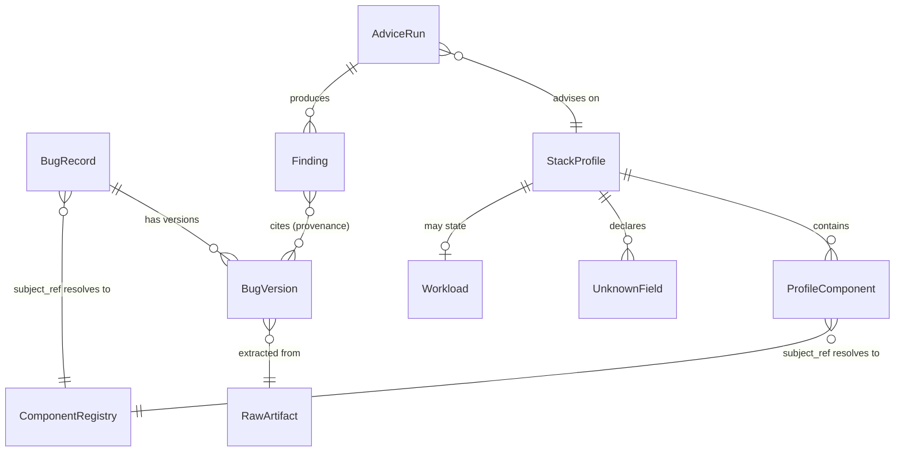

# Stack Profile and Catalog Record — Data Model

**Status:** Draft, for discussion
**Requirements:** FR-1, FR-5, FR-25, FR-29 – FR-33.
**Scope:** The advisor's intermediate representation, the catalog record shape it queries, and
the matching rule between them. Greenfield — no migration path, nothing is deployed.

---

## 1. The catalog needs two axes, not one

The two source documents each describe "seven" things, and they are **not the same seven**:

| `~/Bug Mine.pdf` (FR-1) | Positioning infographic |
| --- | --- |
| LLM models, operating systems, databases, queues, SaaS platforms, languages, repos | Security, functional, performance, compatibility, breaking changes, deprecations, build issues |
| **Subject** — what software the bug is *in* | **Type** — what kind of bug it *is* |

These are orthogonal. A record is a *deprecation* (type) in *Couchbase* (subject); both are
required to describe it, and either alone is useless for retrieval. The coincidence of both
being seven is a trap — modelling one axis and assuming it covers the other loses half the
catalog's meaning.

```
                      TYPE →
  SUBJECT ↓     security  functional  performance  compat  breaking  deprecation  build
  database         ·          ·            ·         ·        ·          ·          ·
  llm model        ·          ·            ·         ·        ·          ·          ·
  saas             ·          ·            ·         ·        ·          ·          ·
  ...
```

---

## 2. Applicability is not always a version range

The harder modelling problem, and the one most likely to be got wrong by defaulting to semver:
**three of the seven subject domains have no versions in the semver sense.**

- A **database**, **language**, **queue**, or **repo** ships versions. `affects 7.0 – 7.2.3` is
  meaningful, and semver comparison works.
- An **operating system** ships builds and kernel revisions that only partially order.
- A **SaaS platform** ships you nothing. Twilio's behavior changes underneath you *on a date*.
  There is no version you are on. "Affected versions" is a category error here.
- An **LLM model** is somewhere between: an identifier (`claude-opus-4-5`) plus, often, a date
  when behavior shifted without the identifier changing.

So applicability is a **union**, not a version range with special cases bolted on:

| Variant | Applies to | Shape |
| --- | --- | --- |
| `VersionRange` | databases, queues, languages, repos | introduced-in, fixed-in, comparison scheme |
| `BuildRange` | operating systems | build/kernel identifiers, partially ordered |
| `TimeWindow` | SaaS platforms | observed-from, observed-until (open if ongoing) |
| `ModelRevision` | LLM models | model identifier + optional effective-from date |

**This is the decision most likely to be regretted if deferred.** A schema that assumes
`version_min`/`version_max` will meet Twilio in week two and grow a nullable-date pair that means
something different per row — the classic shape that is cheap now and expensive after there is
data.

---

## 3. Entities

### `BugRecord` — the stable identity of a known bug

| Field | Type | Notes |
| --- | --- | --- |
| `id` | ULID | Time-ordered; stable across versions (FR-5) |
| `subject_domain` | enum(7) | Axis 1 — §1 |
| `subject_ref` | string | The specific component, e.g. `couchbase-server` |
| `bug_type` | enum(7) | Axis 2 — §1 |
| `applicability` | union | §2 |
| `visibility` | enum | `shared` \| `private:<scope>` — FR-11; scope shape blocked on Q4 |
| `first_seen_at` | timestamptz | UTC |

### `BugVersion` — one observed state of a record

| Field | Type | Notes |
| --- | --- | --- |
| `bug_id` + `version_no` | composite PK | Per-record versioning, per requirements Q3 |
| `content_hash` | bytes | **The dedup key.** No new version unless this changes |
| `title`, `description`, `evidence_url` | text | Extracted content |
| `raw_artifact_id` | FK | Provenance back to what was crawled — enables re-extraction |
| `observed_at` | timestamptz | |

`content_hash` carries the load flagged in `../architecture/ingestion.md` §5: without it, FR-5
mints a version per crawl and catalog size tracks crawl frequency instead of reality.

### `StackProfile` — the advisor's IR

| Field | Type | Notes |
| --- | --- | --- |
| `id` | ULID | |
| `intake_type` | enum | `declared` \| `document` \| `repo` \| `freetext` (FR-21 – FR-24) |
| `components` | `[ProfileComponent]` | |
| `topology` | `[(from, to, protocol)]` | What talks to what — feeds FR-30 |
| `workload` | `Workload?` | Scale, latency, access patterns — feeds FR-31 |
| `unknowns` | `[UnknownField]` | **First-class**, see below |

### `ProfileComponent`

| Field | Type | Notes |
| --- | --- | --- |
| `subject_domain` | enum(7) | Must align with `BugRecord.subject_domain` or retrieval silently misses |
| `subject_ref` | string | Same namespace as `BugRecord.subject_ref` — see §5 |
| `version` | `VersionSpec \| UNKNOWN` | |
| `role` | string? | What it does here |
| `confidence` | enum | `stated` \| `inferred` \| `guessed` — how it entered the profile |

---

## 4. Unknown is a value, not a null

Three states get conflated by a nullable column, and the advisor's honesty (FR-26) depends on
telling them apart:

| State | Meaning | Advisor behavior |
| --- | --- | --- |
| **Absent** | The user did not mention this at all | Not advised on |
| **Unknown** | Known to be present, version not stated | Widen retrieval **and** raise an FR-27 question |
| **Any** | Deliberately unconstrained ("whatever version") | Widen retrieval, no question |

A nullable `version` collapses Unknown and Any, which is precisely the collapse FR-26 forbids —
it turns "I don't know enough to say" into "nothing found". Hence `unknowns` as an explicit list
rather than an inference over nulls.

---

## 5. Naming is the retrieval join, and it will be the bug

`ProfileComponent.subject_ref` and `BugRecord.subject_ref` must occupy **one namespace**. They
are the join key, and a mismatch produces no error — just an empty result that looks like good
news.

`postgres` / `postgresql` / `PostgreSQL` / `psql` all name one thing. This needs a canonical
component registry with aliases, resolved at both write time (extraction) and read time (intake),
before either side accumulates free-text names. Retrofitting canonicalization over an existing
corpus means re-extracting it.

---

## 6. Matching rule

Given a `ProfileComponent`, a `BugRecord` matches when **all** hold:

1. `subject_domain` equal, and `subject_ref` equal after alias resolution (§5).
2. Applicability satisfied per its variant (§2): version comparison for `VersionRange`, set
   membership for `BuildRange`, containment for `TimeWindow`, identifier match for
   `ModelRevision`.
3. Visibility permits the requesting tenant (FR-11).

With `version = UNKNOWN`, step 2 is skipped, every version's records match, and the finding is
marked version-unconfirmed. **This must never be silent** — an unconfirmed match presented as a
confirmed one is the advisor's most damaging failure, since it is both wrong and confident.

---

## 7. Indexes

Driven by the actual queries, not intuition:

| Query | Index |
| --- | --- |
| Advisor retrieval (§6) — the hot path | composite on `(subject_domain, subject_ref)` |
| Current version of a record | `(bug_id, version_no DESC)` |
| Dedup on ingest | unique on `(bug_id, content_hash)` |
| Poll since watermark (FR-8) | `(observed_at)` |

Version-range comparison itself is **not** indexable across the four applicability variants —
filter by component first, then evaluate applicability over the small result set. Trying to index
the range check is what pushes people to flatten the union into columns and lose §2.

---

## 8. ERD



`Finding → BugVersion` is the edge that implements FR-32. A finding with no edge is, by
definition, ungrounded — the Provenance Gate in `../architecture/advisor.md` §3 is a check on
whether this relationship is populated, which is why grounding is a schema property here rather
than a prompt instruction.

---

## 9. Open decisions

| # | Decision | Blocked on |
| --- | --- | --- |
| **M-D1** | Whether `applicability` is a tagged union column (JSON) or four side tables | Query patterns at scale; JSON is right while seeded |
| **M-D2** | Alias resolution: curated registry vs learned mapping | How many components launch coverage includes |
| **M-D3** | Whether `visibility` is per-record or per-tenant-partition | Requirements Q4 |
| **M-D4** | Whether own-code findings (FR-36) share the `Finding` table given they have no `BugVersion` edge | Own-code design pass |
